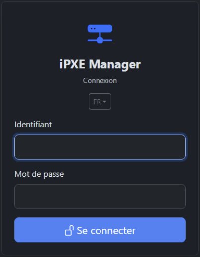
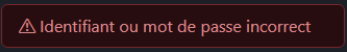
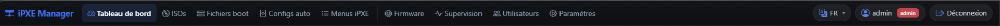
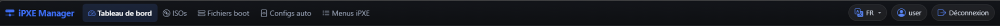
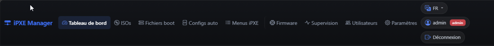
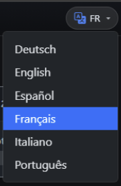

# Connexion et navigation

## Accéder au site

Ouvrez un navigateur et allez à l’adresse de votre serveur, par exemple :

```text
http://192.168.2.6/
```

Si HTTPS est activé sur votre déploiement :

```text
https://192.168.2.6/
```

(Le navigateur peut afficher « Non sécurisé » avec un certificat interne — comportement normal.)

---

## Page de connexion

Si vous n’êtes pas connecté, toute URL renvoie vers **`/login`**.

| Champ | Description |
|-------|-------------|
| Identifiant | Nom d’utilisateur (minuscules, chiffres, tirets) |
| Mot de passe | Mot de passe du compte |

Identifiants par défaut après installation : **`admin`** / **`admin`** — à changer immédiatement dans **Paramètres**.








---

## Barre de navigation (après connexion)

Barre **sticky** en haut de toutes les pages :

### Groupe « Exploitation » (tous les utilisateurs connectés)

| Icône | Menu | Rôle |
|-------|------|------|
| Compteur | **Tableau de bord** | Vue d’ensemble |
| Disque | **ISOs** | Versions et ISOs |
| Pile | **Fichiers Boot** | Fichiers par version |
| Code | **Configs auto** | Preseed, cloud-init, etc. |
| Liste | **Menus iPXE** | Scripts `.ipxe` |

### Groupe « Administration » (compte **Administrateur** uniquement)

| Menu | Rôle |
|------|------|
| **Firmware** | Compilation iPXE → TFTP |
| **Supervision** | Santé serveur, audits |
| **Utilisateurs** | Comptes, mots de passe |
| **Paramètres** | URL, TLS, types d’OS, logo menu |











---

## Sélecteur de langue

En haut à droite : bouton du type **FR** / **EN** avec icône traduction.

- Cliquez → liste : Français, English, Deutsch, Español, Italiano, Português.
- La page se recharge dans la langue choisie (cookie `lang`).





---

## Déconnexion

Bouton **Déconnexion** (icône porte sortante) à droite de la barre → retour à `/login`.

---

## Pages suivantes

- [02-roles-et-permissions.md](02-roles-et-permissions.md)
- [03-tableau-de-bord.md](03-tableau-de-bord.md)
