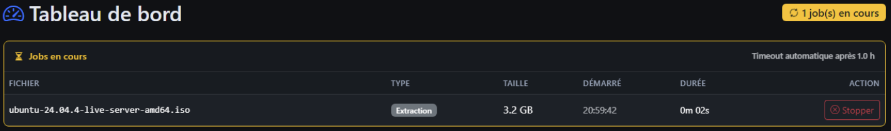
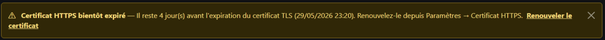
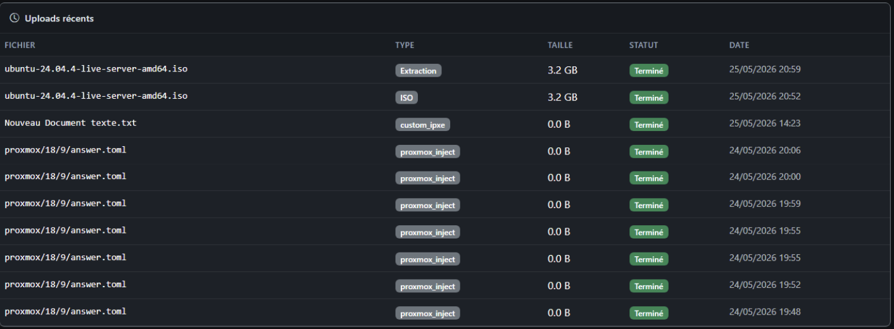
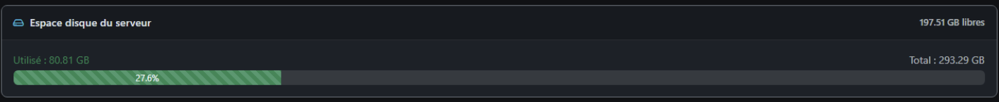
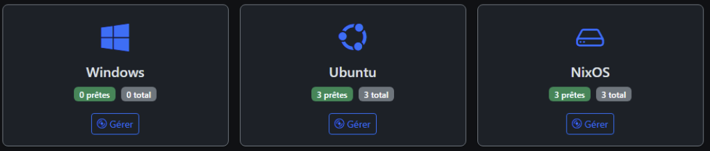
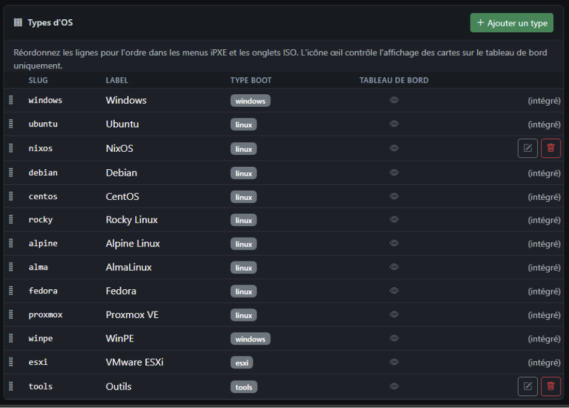
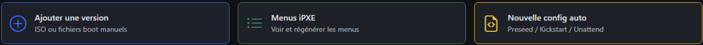

# Tableau de bord

**URL :** `/`  
**Menu :** Tableau de bord (icône compteur de vitesse)

Page d’accueil après connexion : état du serveur, tâches en cours, accès rapide aux OS.

---

## Bandeau titre et jobs actifs

Si des tâches Celery tournent (extraction, compilation firmware, etc.) :

- Badge **« X job(s) en cours »** (jaune, icône qui tourne).
- Bouton **Tout arrêter** (admin / selon configuration) pour forcer l’arrêt des uploads suivis.

---

## Alerte certificat TLS

Si le certificat HTTPS expire bientôt : alerte **orange** avec lien vers **Paramètres → Renouveler le certificat**.

---

## Tableau des jobs en cours

Colonnes typiques :

| Colonne | Signification |
|---------|---------------|
| Fichier | Nom du fichier ou libellé de tâche |
| Type | ISO, Extraction, etc. |
| Taille | Taille concernée |
| Démarré | Heure locale (fuseau du **navigateur**) |
| Durée | Compteur mis à jour en direct |
| Action | **Arrêter** ce job (confirmation) |

---

## Espace disque

Carte avec barre de progression :

- **Utilisé** / **Total** (Go)
- Couleur : vert → orange → rouge selon le pourcentage (> 65 %, > 85 %)

---

## Cartes par type d’OS

Une carte par **type d’OS** configuré (Debian, Ubuntu, Windows, etc.) :

- Nombre de versions **prêtes** / **total**
- Bouton **Gérer** → liste ISOs filtrée ou page ISOs
- Icône **œil** : masquer la carte du tableau de bord (réglage dans **Paramètres**, ordre des types d’OS)

Les types masqués du tableau de bord restent utilisables ailleurs (ISOs, menus).

---

## Raccourcis en bas de page

Souvent :

- **Ajouter un OS** → `/isos/upload`
- **Menus iPXE** → `/ipxe-menus`
- **Nouvelle config auto** → création config

---

## Voir aussi

- [14-taches-arriere-plan.md](14-taches-arriere-plan.md) — détail Celery
- [04-isos-liste-et-ajout.md](04-isos-liste-et-ajout.md)
