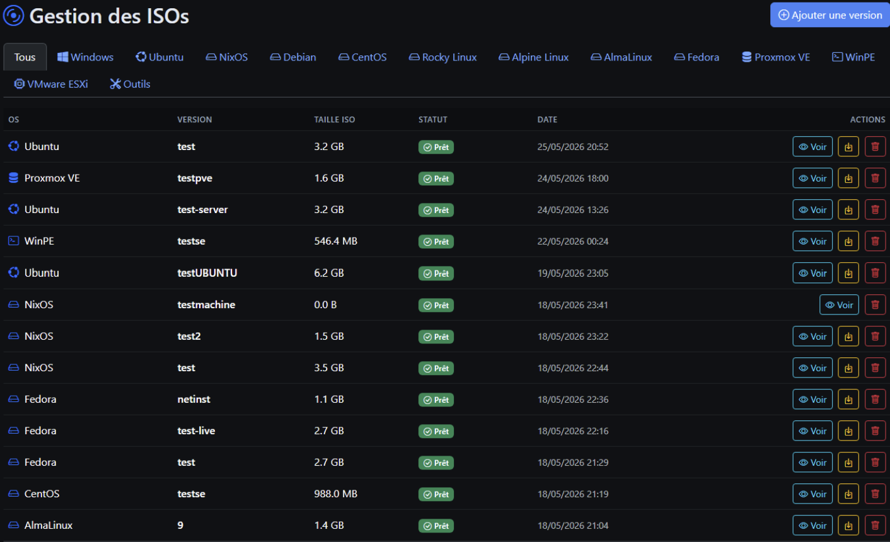
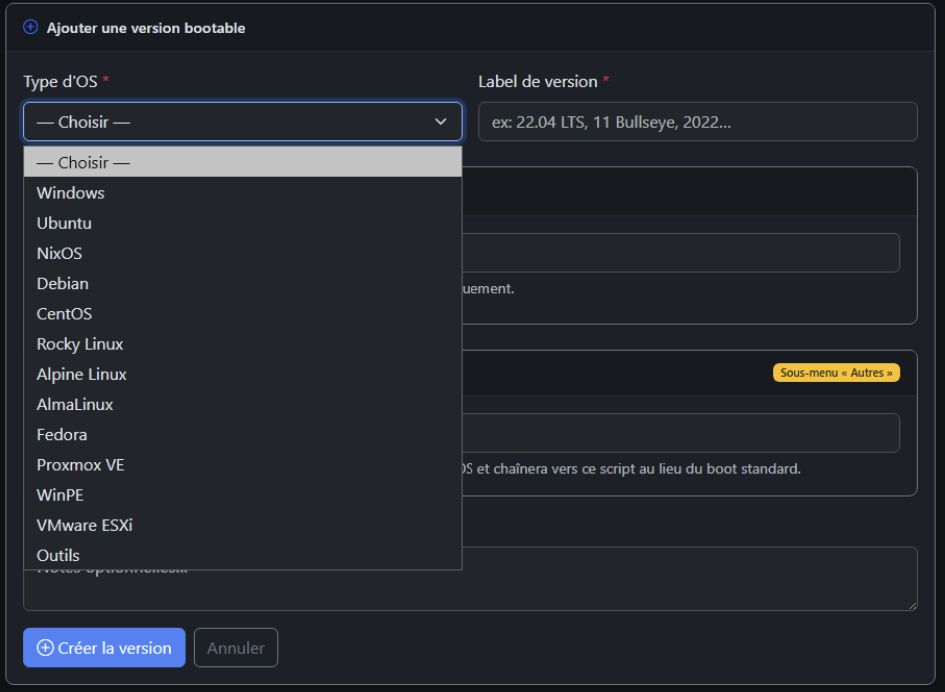
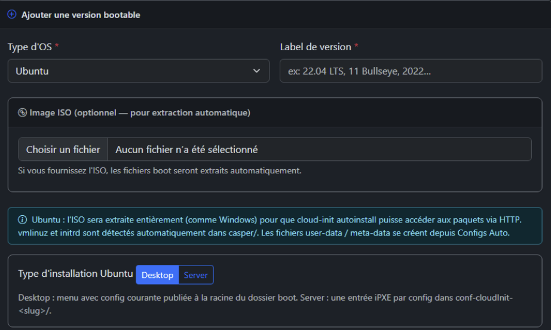
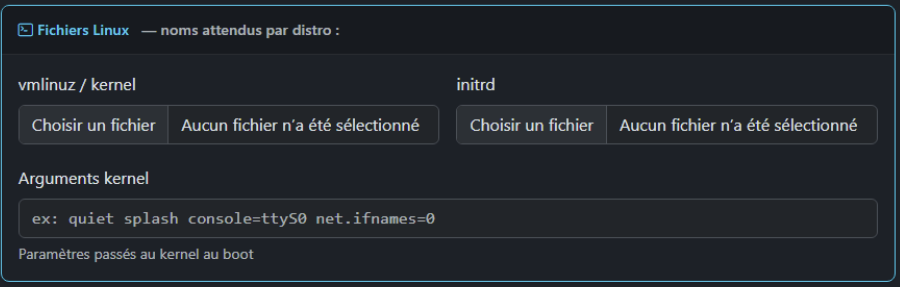
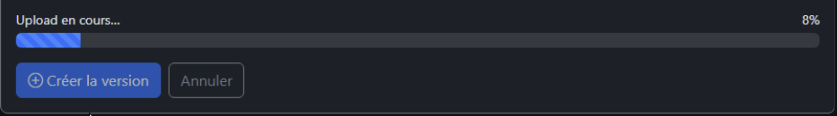
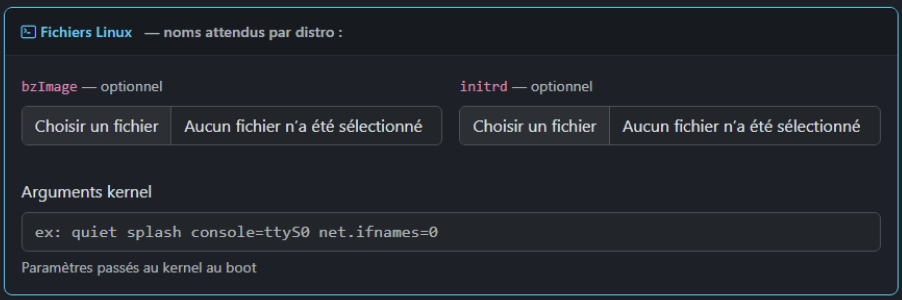

# ISOs — Liste et ajout de version

## Liste des ISOs

**URL :** `/isos`  
**Menu :** ISOs

Tableau des **versions** (une ligne = une version d’un type d’OS : ex. Debian 12, Ubuntu 22.04 LTS).

| Colonne | Description |
|---------|-------------|
| OS | Type (Debian, Ubuntu, …) |
| Version | Libellé choisi à l’ajout |
| Taille ISO | Taille du fichier ISO sur disque |
| Statut | Prêt, Extraction en cours, Erreur, Uploadé |
| Date | Date d’ajout |
| Actions | Détail, suppression, etc. |

**Statuts :**

- **Uploadé** — ISO ou fichiers enregistrés, extraction pas encore lancée (ou pas d’ISO).
- **Extraction en cours** — tâche Celery ; la ligne peut se mettre à jour automatiquement (polling).
- **Prêt** — Fichiers de boot utilisables pour les menus.
- **Erreur** — Échec d’extraction ; ouvrir la fiche pour le détail.

---

## Ajouter une version

**URL :** `/isos/upload`  
Bouton depuis la liste ISOs ou le tableau de bord.

### Champs principaux

| Champ | Obligatoire | Rôle |
|-------|-------------|------|
| Type d’OS | Oui | Debian, Ubuntu, Windows, Fedora, Proxmox, type personnalisé… |
| Libellé de version | Oui | Ex. `22.04 LTS`, `11`, `2022` |
| Fichier ISO | Non | Si fourni → extraction automatique possible ensuite |
| Arguments noyau | Non | Paramètres kernel ajoutés au boot |
| Script iPXE personnalisé | Non | Fichier `.ipxe` → sous-menu « Autres » |
| Notes | Non | Mémo interne |

---

### Section ISO

- Choix du fichier `.iso` ou `.img`.
- Texte d’aide : l’extraction des fichiers de boot pourra être lancée **depuis la fiche version** (pas forcément pendant l’upload).
- **Doublon** : si même type + libellé + nom de fichier ISO → badge avertissement avant envoi.

---

### Fichiers boot manuels (sans ISO)

Selon le type d’OS, des sections apparaissent :

- **Linux** : vmlinuz, initrd, modloop (Alpine), dépôt APK personnalisé (Alpine).
- **Windows** : upload de l'iso obligatoire.

> **Pilotes et firmware :** les ISO « netinst » ou minimales (Debian sans `-firmware`, certaines images server allégées, etc.) n’embarquent pas toujours les pilotes réseau ou disque requis par votre matériel. Si l’installateur ne voit **aucun disque** ou n’affiche que **`lo`** en réseau, la cause est **très probablement** un manque de pilotes dans le `vmlinuz` / `initrd` extraits. Privilégiez une ISO **with firmware** à l’ajout ; sinon vous pourrez **remplacer** ces fichiers plus tard dans **Fichiers Boot**. Voir [06-fichiers-boot.md](06-fichiers-boot.md#pilotes-et-firmware-attention-aux-iso-minimales).

**Ubuntu** : choix variante **Server** vs **Desktop** ; message indiquant extraction complète type casper.

---

### Upload en cours

L’envoi d’une grosse ISO utilise souvent **XHR** avec barre de progression (pas de rechargement brutal de page).

Messages possibles : espace disque insuffisant, doublon, erreur réseau.

---

### Plan d’extraction (types d’OS personnalisés)

Pour les types configurés dans **Paramètres**, un encadré peut lister les **noms de fichiers** recherchés dans l’ISO selon la fiche « Extraction ISO » du type.

---

## Après l’ajout

Redirection vers la **fiche version** (`/isos/{id}`) ou la liste.  
Suite : [05-isos-fiche-version.md](05-isos-fiche-version.md).
