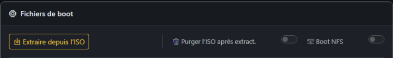
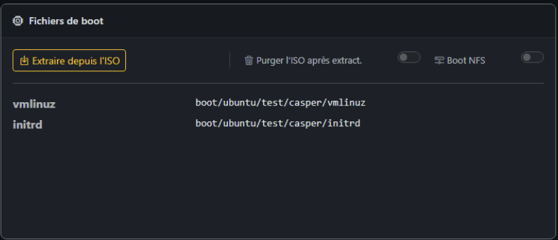
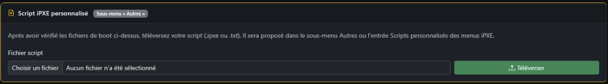
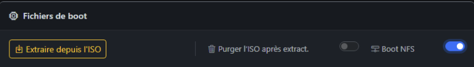
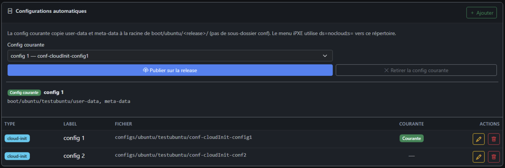
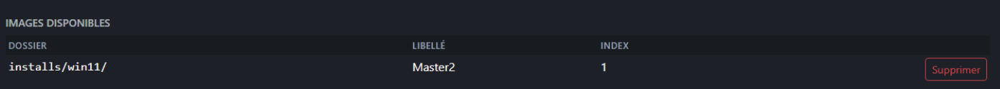
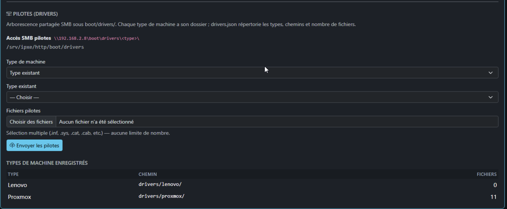
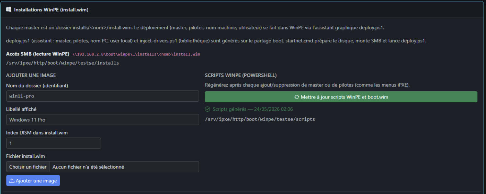

# ISOs — Fiche d’une version

**URL :** `/isos/{id}`  
Accès : clic sur une ligne dans **ISOs** ou après un upload.

En-tête : type d’OS + libellé + **badge de statut** (Prêt, Extraction…, Erreur).

---

## Carte Informations

- ID, taille ISO, URL HTTP publique de l’ISO (si présente), chemin disque serveur.
- **Ubuntu** : badge Server ou Desktop.
- Notes éventuelles.

---

## Carte Fichiers de boot

### Barre d’outils (si vous pouvez modifier)

| Action | Rôle |
|--------|------|
| **Extraire depuis l’ISO** | Lance Celery : décompresse l’ISO vers `http/boot/...` |
| **Supprimer ISO après extraction** | Case à cocher : efface l’ISO disque après **prochaine** extraction réussie (gain de place) |
| **Boot NFS dans le menu** | **Ubuntu** : bascule HTTP autoinstall vs netboot NFS (casper) |
| **Remplacer boot.wim** | **Windows** : upload d’un nouveau `boot.wim` |

**Ré-extraction** : une confirmation apparaît si l’ISO a déjà été extraite (risque d’écraser les fichiers boot).

---

### Contenu affiché

Liste des fichiers détectés : `vmlinuz`, `initrd`, `boot.wim`, chemins ESXi, rapport d’extraction (fichiers recherchés), etc.

**Arguments noyau** : champ éditable + enregistrement (si droits).

> **Manque de pilotes ?** Si l’installateur ne détecte pas le disque ou n’a que l’interface réseau `lo`, les fichiers extraits (`vmlinuz`, `initrd`) sont probablement trop minimalistes pour votre hardware. Ré-extraire depuis une ISO **with firmware**, ou remplacer ces fichiers via **Fichiers Boot** ([06-fichiers-boot.md](06-fichiers-boot.md#pilotes-et-firmware-attention-aux-iso-minimales)). Lien direct depuis la fiche : **Fichiers Boot** dans le menu ou le texte d’aide « upload manuel ».

---

### Erreur d’extraction

Bandeau rouge avec message ; parfois extrait des logs Celery. Si vide : consulter `journalctl -u ipxe-celery` sur le serveur.

---

### Extraction en cours

Badge **Extraction en cours** avec icône animée ; la page peut interroger le serveur toutes les ~8 s jusqu’à statut final.

---

## Script iPXE personnalisé (carte dédiée)

Upload `.ipxe` ou `.txt` pour cette version → apparaît dans **Menus iPXE → Scripts personnalisés** et sous-menu **Autres** du OS.

---

## Ubuntu — NFS vs HTTP autoinstall

Interrupteur **Boot NFS (casper)** :

- **Désactivé** (défaut) : autoinstall HTTP, `root=/dev/ram0`, URL ISO si fichier encore sur le serveur.
- **Activé** : menu généré avec `netboot=nfs` (nécessite vmlinuz/initrd extraits + infra NFS côté serveur).

---

## Configurations automatiques liées

Liens vers configs **Ubuntu** (user-data / meta-data), **Proxmox** (answer.toml), etc. selon l’OS.

Boutons **Publier sur la version** / **Retirer config active** pour Ubuntu (copie vers `boot/ubuntu/<version>/`).

---

## Windows / WinPE — section déploiement

Pour les versions **Windows** avec WinPE :

### Images d’installation (`install.wim`)

- **Masters** : dossiers `installs/<nom>/install.wim`
- Ajout : identifiant dossier, libellé, index DISM, fichier `.wim`
- **Image active** + **Patcher boot.wim (startnet.cmd)**

### Pilotes

- Arborescence `boot/drivers/<type machine>/`
- Upload multi-fichiers `.inf`, `.sys`, `.cab`…
- Catalogue `drivers.json`

### Scripts WinPE

Bouton **Mettre à jour les scripts WinPE et boot.wim** :

- Génère `deploy.ps1`, `inject-drivers.ps1`, `masters.json` sur le partage
- Injecte `startnet.cmd` dans `boot.wim` (tâche Celery)

---

## Voir aussi

- [06-fichiers-boot.md](06-fichiers-boot.md)
- [07-configurations-automatiques.md](07-configurations-automatiques.md)
- [14-taches-arriere-plan.md](14-taches-arriere-plan.md)
