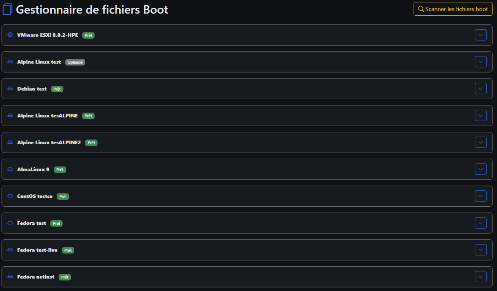
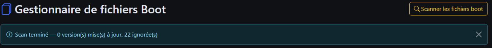
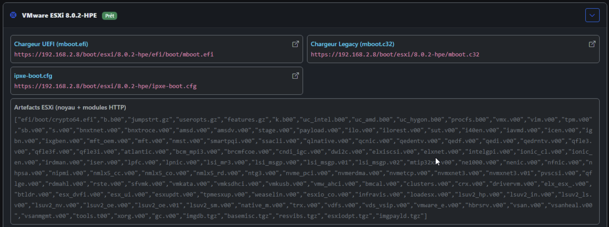
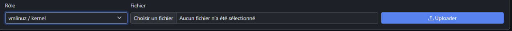

# Fichiers Boot

**URL :** `/boot-files`  
**Menu :** Fichiers Boot

Vue **centralisée** de tous les fichiers de boot par version (complément de la fiche ISO).

---

## Objectif

- Voir rapidement quelles versions ont un **BootEntry** (noyau, initrd, boot.wim, etc.).
- **Remplacer** ou **ajouter** des fichiers sans repasser par tout le formulaire d’upload ISO.
- **Scanner** le disque pour enregistrer des fichiers déjà copiés manuellement sous `http/boot/`.

---

## Structure de la page

Souvent organisée par **type d’OS**, puis **version**, avec pour chaque entrée :

| Élément | Exemple |
|---------|---------|
| Rôle / fichier | vmlinuz, initrd, boot.wim, BCD, modloop |
| Chemin relatif | Sous `boot/<os>/<version>/` |
| Actions | Upload, édition args kernel |

---

## Scanner les fichiers boot

Bouton du type **Scanner boot/** :

- Parcourt `boot/` sur le serveur
- Met à jour les enregistrements en base pour les fichiers déjà présents
- Affiche un résumé : X versions mises à jour, Y ignorées, erreurs éventuelles

Utile après une copie manuelle SSH/rsync.

---

## Upload de fichiers

Pour une version donnée, remplacement ciblé :

- **boot.wim** (Windows)
- **vmlinuz** / **initrd** (Linux)
- **modloop** (Alpine)
- Fichiers **ESXi** (mboot, modules)
- **Script iPXE** personnalisé

Les libellés reflètent les **vrais noms** sur disque (ex. `vmlinuz-lts`).

---

## Arguments noyau (imgargs)

Champ pour modifier les **paramètres kernel** passés au boot iPXE (quiet, console série, repo inst., etc.).

Enregistrement → régénération des menus recommandée (**Menus iPXE → Régénérer tous**).

---

## Pilotes et firmware (attention aux ISO minimales)

> **Important :** tous les ISO d’installation ne contiennent **pas** les pilotes nécessaires à votre matériel (carte réseau, contrôleur disque RAID/NVMe, etc.). iPXE Manager extrait les fichiers de boot **tels qu’ils sont dans l’ISO** : si l’ISO est « netinst » ou minimale sans firmware, le `vmlinuz` / `initrd` déployés n’auront pas non plus ces pilotes.

### Symptômes typiques côté installateur

| Symptôme | Cause probable |
|----------|----------------|
| L’installateur **ne voit aucun disque** | Pilote contrôleur stockage absent (NVMe exotique, RAID, HBA…) |
| Seule l’interface **`lo` (local)** apparaît | Pilote carte réseau absent — pas de DHCP possible pour la suite |
| Écran d’erreur ou blocage **juste après le boot** iPXE | Noyau/initrd incompatibles ou trop minimal pour le hardware |
| Installation OK en **ISO USB** mais pas en PXE | L’ISO USB utilisée inclut peut‑être plus de firmware que celle extraite ici |

Ces signes pointent **très probablement** vers un **manque de pilotes** dans les fichiers de boot, pas vers un dysfonctionnement du menu iPXE en lui‑même.

### Que faire

1. **Choisir une ISO plus complète** dès l’ajout de version, quand elle existe :
   - **Debian** : préférer `debian-*-amd64-netinst-**firmware**.iso` plutôt que la netinst standard.
   - **Ubuntu / Fedora / autres** : variantes « full », live, ou images explicitement « with firmware » selon le éditeur.
2. **Ré-extraire** depuis la fiche version après avoir remplacé l’ISO, **ou** remplacer manuellement les fichiers concernés.
3. **Remplacer les fichiers de boot** dans **Fichiers Boot** (cette page) :
   - rôle **vmlinuz / kernel** → nouveau noyau contenant les modules requis ;
   - rôle **initrd** → initrd reconstruit ou issu d’une ISO/firmware pack adapté.
4. **Sauvegarder** puis **régénérer les menus** si besoin (**Menus iPXE → Régénérer tous**).

Vous devrez en général **trouver vous‑même** les bons fichiers (autre ISO, paquet `firmware-*`, initrd custom, documentation du fabricant). iPXE Manager ne télécharge pas de pilotes tiers : il sert et enregistre les fichiers que vous fournissez.

### Windows / WinPE

Pour **Windows en mode WinPE**, l’injection de pilotes se fait plutôt via la fiche version (ZIP pilotes, `boot.wim`). Voir [05-isos-fiche-version.md](05-isos-fiche-version.md). La page **Fichiers Boot** reste utilisable pour remplacer `boot.wim` directement.

---

## Permissions

Même règles que les ISOs : modification uniquement sur **vos** versions (utilisateur) ou toutes (admin).

---

## Voir aussi

- [05-isos-fiche-version.md](05-isos-fiche-version.md)
- [08-menus-ipxe.md](08-menus-ipxe.md)
