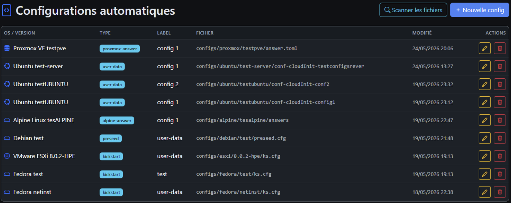
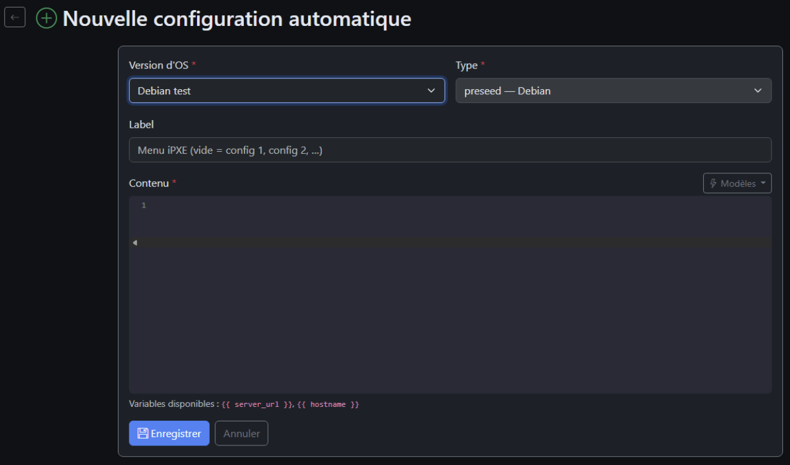
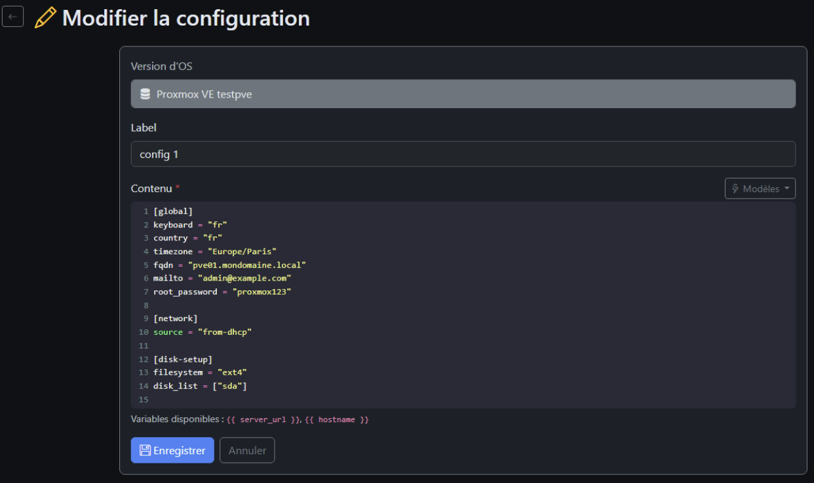
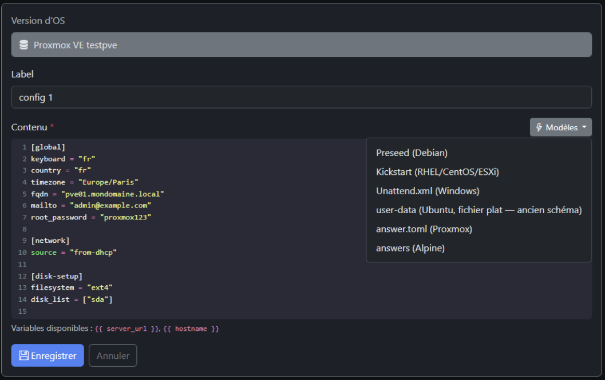

# Configurations automatiques

**URL :** `/ipxe-configs`  
**Menu :** Configs auto (ou « Configurations automatiques »)

Gestion des fichiers d’**installation automatique** liés à une **version ISO** : preseed, kickstart, cloud-init, autounattend, answer.toml, etc.

---

## Liste des configurations

Tableau : OS / version, **type** de config, libellé, fichier, date, actions (éditer, supprimer).

---

## Scanner configs/

Comme pour boot/ : importe les fichiers déjà présents sous `configs/` sur le disque mais non enregistrés en base.

---

## Créer une configuration

**Formulaire** (nouvelle config) :

| Champ | Description |
|-------|-------------|
| Version OS | Version cible |
| Type | preseed, kickstart, Ubuntu autoinstall (paire user-data+meta-data), proxmox-answer, alpine-answer, custom… |
| Nom du dossier | Ex. `config-1`, `prod-web` — chemin sous la version |
| Libellé menu iPXE | Texte affiché dans le sous-menu d’install |
| Contenu | Éditeur (CodeMirror sur la page d’édition) |

Les types **imposés** par le seed pour les OS intégrés (ex. Debian → preseed) : le type est verrouillé à la création.

---

## Éditer une configuration

Page d’édition avec **éditeur de code** (coloration selon le type : shell, XML, YAML).

- Boutons **Modèles** : insère un template vide (preseed, kickstart, unattended, cloud-init, etc.)
- Variables documentées dans l’aide (hostname, miroir, etc.)

---

## Types par famille (référence)

| OS / famille | Type UI | Fichiers typiques |
|--------------|---------|-------------------|
| Debian | preseed | `preseed.cfg` |
| Ubuntu | autoinstall | `user-data` + `meta-data` |
| RHEL / Rocky / Alma / Fedora / ESXi | kickstart | `ks.cfg` |
| Windows | unattend | `autounattend.xml` |
| Proxmox | proxmox-answer | `answer.toml` |
| Alpine | alpine-answer | `answers` / apkovl |

---

## Proxmox

`answer.toml` publié ; si config active, tâche Celery peut préparer `proxmox-netboot-autoinstall.iso` (assistant Proxmox).

---

## Après modification

Pensez à **Régénérer tous les menus** ([08-menus-ipxe.md](08-menus-ipxe.md)) pour que les entrées d’install et les URLs de config soient à jour.

---

## Voir aussi

- [05-isos-fiche-version.md](05-isos-fiche-version.md)
- [10-parametres.md](10-parametres.md) — types d’OS et contrainte autoconfig
