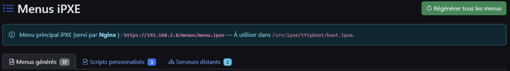
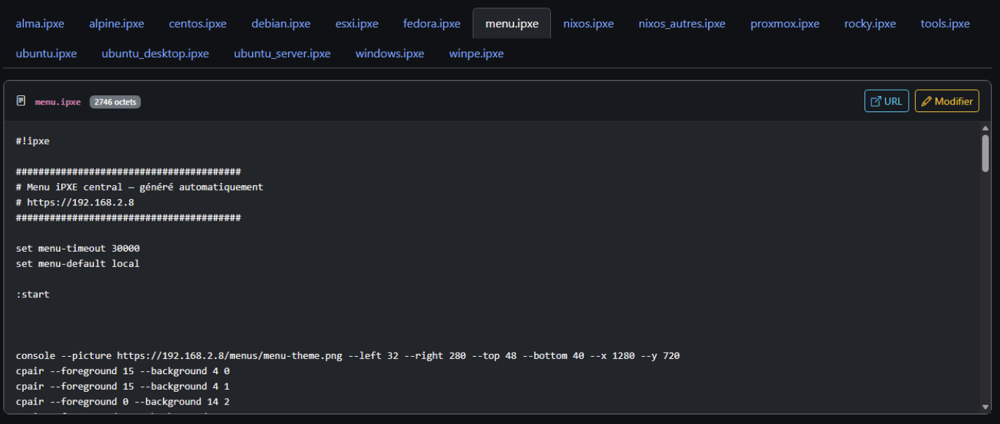
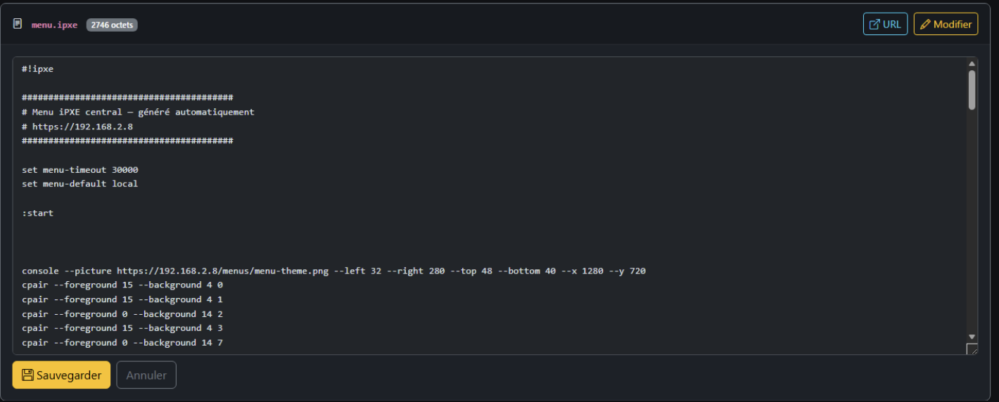
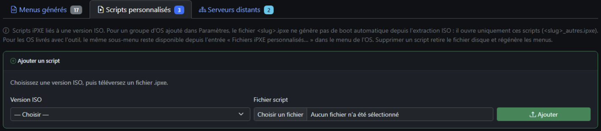
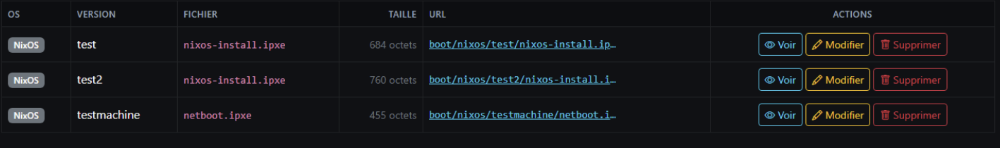
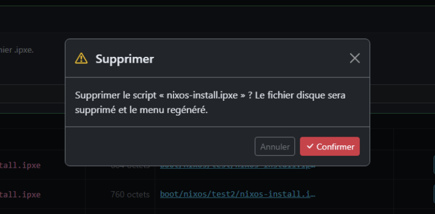
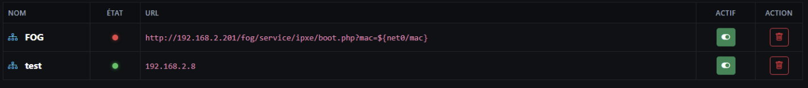
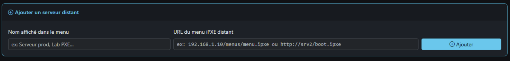

# Menus iPXE

**URL :** `/ipxe-menus`  
**Menu :** Menus iPXE

Trois onglets principaux : **Menus générés**, **Scripts personnalisés**, **Serveurs distants** (admin pour le dernier).

Bandeau info : URL du menu central `http://<serveur>/menus/menu.ipxe` et lien TFTP `boot.ipxe`.

Bouton global : **Régénérer tous les menus** (tâche Celery — régénère tous les `.ipxe` à partir de la base).

---

## Onglet 1 — Menus générés

Sous-onglets : **un fichier `.ipxe` par onglet** (menu.ipxe, debian.ipxe, windows.ipxe, …).

### Aperçu du script

- Le contenu est chargé **à la demande** (pas tout d’un coup au chargement de la page).
- Texte initial : « Chargement du script… » puis contenu du fichier.
- Changer d’onglet `.ipxe` déclenche le chargement de ce fichier.

### Actions (admin)

| Bouton | Action |
|--------|--------|
| Ouvrir URL | Ouvre le fichier servi par Nginx (nouvel onglet) |
| Modifier | Bascule en mode édition (textarea) |
| Sauvegarder | POST du contenu — **attention** : une régénération globale peut écraser des modifs manuelles selon le flux |
| Annuler | Retour aperçu |

---

## Onglet 2 — Scripts personnalisés

Scripts liés à une **version ISO** (BootEntry avec `custom_ipxe_path`).

### Tableau

Colonnes : OS, version, fichier, taille, URL, actions **Voir** / **Modifier** / **Supprimer**.

### Ajouter un script

Carte en haut :

1. Choisir **version ISO**
2. Téléverser `.ipxe` ou `.txt`

### Panneau Voir / Modifier (inline)

Clic **Voir** ou **Modifier** ouvre un panneau sous la ligne :

- Onglets **Aperçu** / **Éditeur**
- Chargement lazy du contenu (même principe que menus générés)
- Sauvegarde → régénération menus en arrière-plan

---

## Onglet 3 — Serveurs distants (admin)

Chainload vers un **autre menu iPXE** (autre serveur PXE).

### Ajouter

| Champ | Exemple |
|-------|---------|
| Nom affiché | Serveur prod, Lab PXE |
| URL | `http://192.168.1.10/menus/menu.ipxe` |

L’URL est utilisée **telle quelle** dans `menu.ipxe` (`chain --autofree`).

### Tableau

Nom, **état** (LED joignable), URL, interrupteur **Actif**, supprimer.

- LED : mise à jour au chargement de l’onglet et périodiquement (~90 s) par sondes HTTP
- Désactiver : entrée grisée, absente du menu généré au prochain regen

---

## Erreur de régénération

Si la régénération échoue : alerte rouge en haut avec extrait d’erreur.

---

## Voir aussi

- [09-firmware-ipxe.md](09-firmware-ipxe.md) — embed chainload vers menu.ipxe
- [15-parcours-boot-pxe.md](15-parcours-boot-pxe.md)
