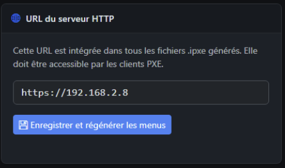
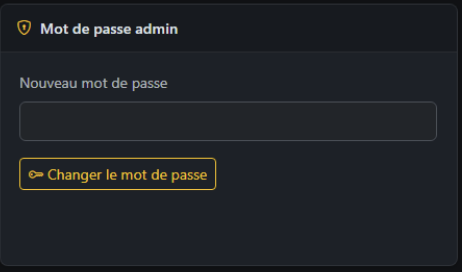
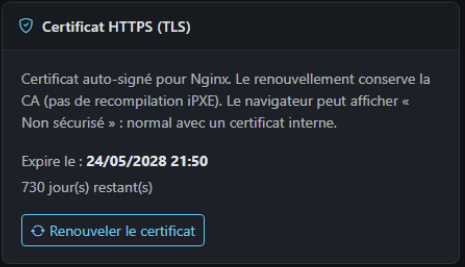
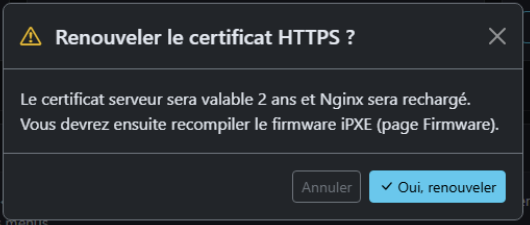
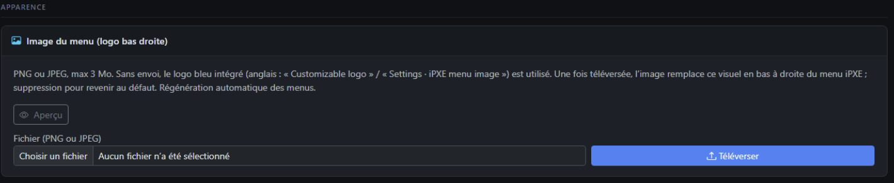
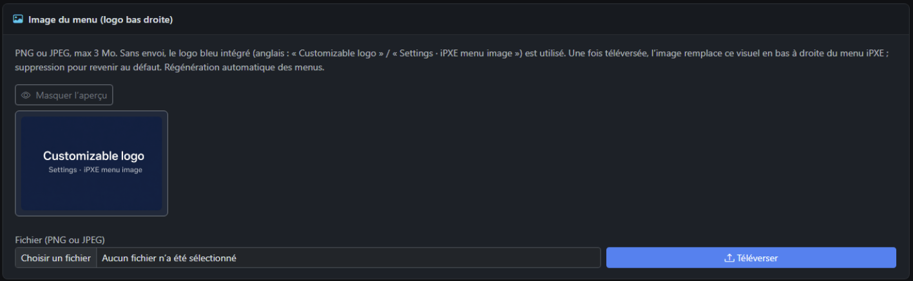
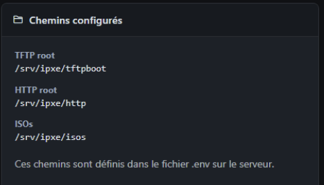
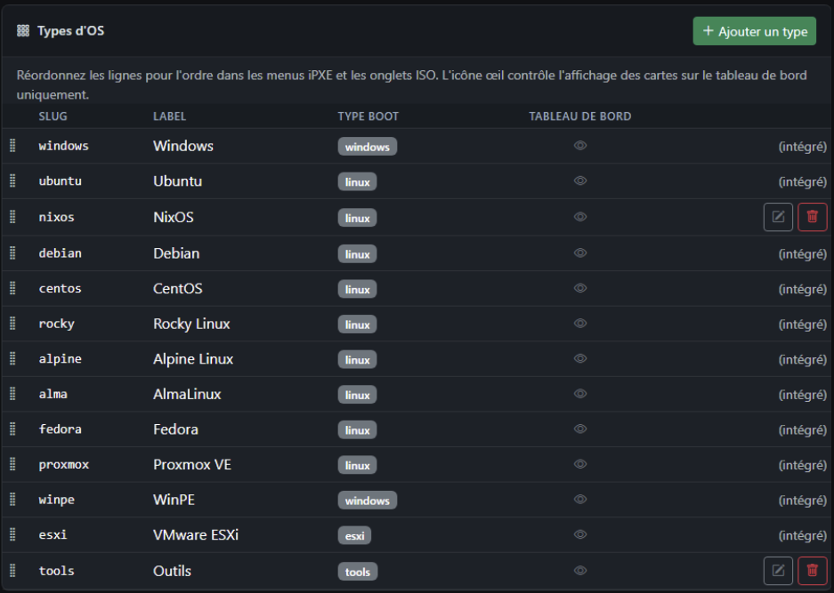
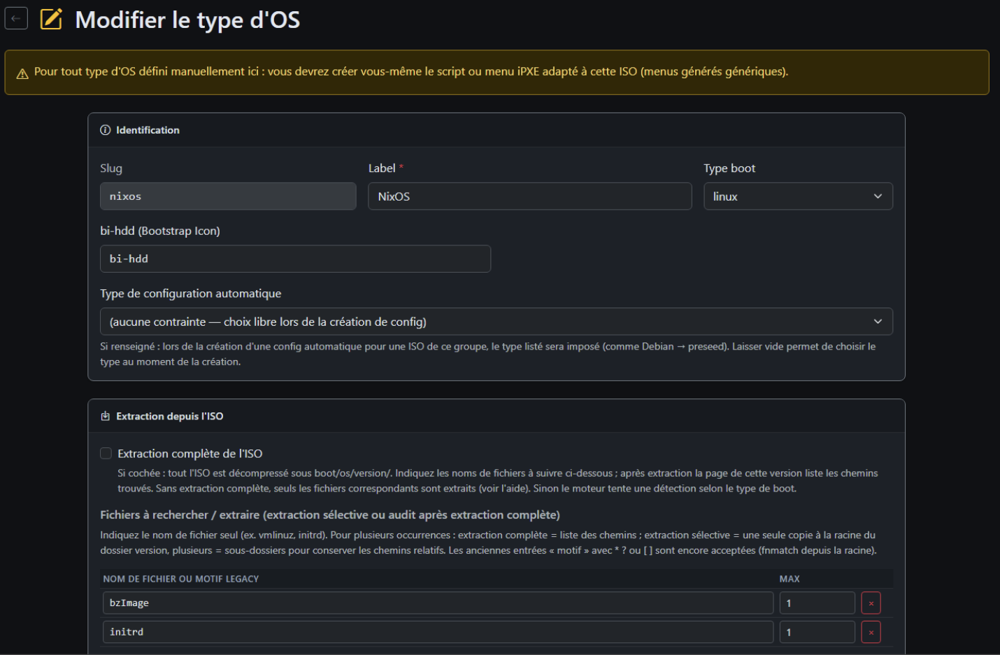

# Paramètres

**URL :** `/settings`  
**Menu :** Paramètres (administrateur)

Configuration globale du site et de la génération des menus.

---

## Section Serveur

Trois cartes côte à côte :

### URL du serveur HTTP

- Champ **URL de base** (ex. `http://192.168.2.6`)
- Intégrée dans **tous** les `.ipxe` générés
- Bouton **Enregistrer et régénérer les menus** → sauve + tâche regen menus

### Mot de passe administrateur

- Nouveau mot de passe (min. 8 caractères)
- **Changer le mot de passe** — concerne le compte admin connecté (session)

### Certificat HTTPS (TLS)

- Date d’expiration, jours restants
- Badge alerte si expiration proche
- **Renouveler le certificat** → modale de confirmation (2 ans, reload Nginx, **recompiler firmware ensuite**)

---

## Section Apparence — Image du menu iPXE

- Upload **PNG/JPEG** (max 3 Mo) — logo coin **bas droite** des menus iPXE
- **Aperçu** / masquer aperçu
- **Supprimer l’image personnalisée** → revient au logo bleu intégré
- Régénération automatique des menus après changement

---

## Section Système — Chemins configurés

Lecture seule : chemins TFTP, HTTP, ISOs depuis le `.env` serveur.

---

## Types d’OS

Tableau des types (slug, label, type boot, visibilité dashboard).

| Action | Rôle |
|--------|------|
| **Glisser-déposer** | Ordre dans menus iPXE et onglets ISO |
| **Œil** | Afficher / masquer carte sur tableau de bord |
| **Modifier** | Fiche type (extraction ISO, patterns fichiers, type autoconfig) |
| **Ajouter** | Nouveau type personnalisé |
| **Supprimer** | Types intégrés (seed) : **non supprimables** |

---

## Éditer un type d’OS

Fiche dédiée (`/settings/os-types/new` ou `/edit/{id}`) :

- **Identité** : slug, label, icône Bootstrap
- **Extraction ISO** : case extraction complète, liste noms de fichiers / motifs
- **Avertissement** : types manuels = script iPXE à écrire vous-même
- **Type config auto** : contraindre preseed / kickstart / etc.

---

## Messages flash

Après actions : alertes vertes/rouges en haut (mot de passe OK, image enregistrée, échec TLS, etc.).

---

## Voir aussi

- [04-isos-liste-et-ajout.md](04-isos-liste-et-ajout.md)
- [09-firmware-ipxe.md](09-firmware-ipxe.md)
