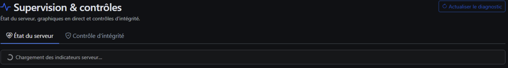
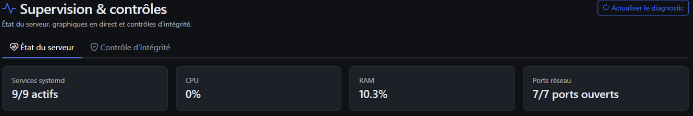
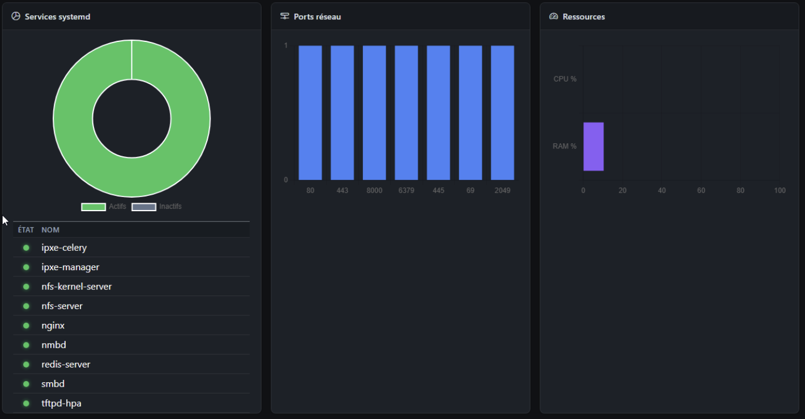
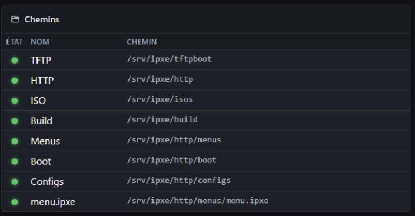
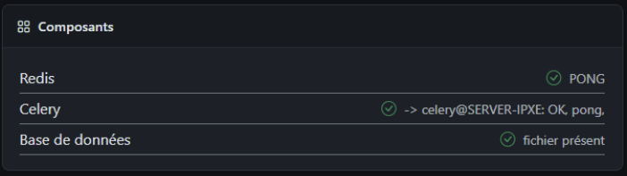

# Supervision

**URL :** `/admin/supervision`  
**Menu :** Supervision (administrateur uniquement)

Page de **santé du serveur** en temps quasi réel et d’**audits d’intégrité** (vérifications fichiers, services, base de données).

---

## Accès et chargement initial

À l’ouverture, l’onglet **Santé** est actif. Un bandeau « Chargement… » apparaît le temps de récupérer le premier **snapshot** (API JSON), puis les graphiques et tableaux se remplissent.

Bouton **Actualiser** (en haut à droite) : relance une requête snapshot sans recharger toute la page.

---

## Onglet Santé

### Cartes résumé (ligne du haut)

Quatre indicateurs compacts :

| Carte | Contenu |
|-------|---------|
| Services | Nombre actifs / total |
| CPU | Utilisation % |
| RAM | Utilisation % |
| Ports | Ports d’écoute utiles ouverts |

### Graphiques et tableaux

| Zone | Rôle |
|------|------|
| **Services** | Donut Chart.js + tableau nom / état (actif, inactif, absent) |
| **Ports** | Graphique des ports réseau surveillés |
| **Ressources** | CPU + RAM combinés |
| **Disque** | Barres par point de montage (usage %) |
| **Hôte** | Tableau machines / VM détectées + détails texte |
| **Chemins** | TFTP, HTTP, ISOs, etc. — existe / manquant |
| **Contrôles** | Liste de checks rapides (binaires, permissions, …) |

Les graphiques se mettent à jour lors de chaque snapshot (rafraîchissement périodique côté navigateur).

### Pied de page Santé

- **Dernière mise à jour** : horodatage du dernier snapshot
- Indication **sudo** : si l’agent peut exécuter des commandes système pour l’audit (sinon message limité)

---

## Onglet Intégrité

Actions administratives (souvent avec **modale de confirmation** — voir [13-dialogues-et-confirmations.md](13-dialogues-et-confirmations.md)) :

| Bouton | Action |
|--------|--------|
| **Vérification rapide** | Contrôles légers (services, chemins clés) |
| **Vérification complète** | Audit approfondi (plus long) — confirmation |
| **Synchroniser la base** | Réaligner la BDD avec le disque (versions, fichiers) — confirmation |
| **Relancer les services** | Redémarrage stack iPXE (Nginx, workers, etc.) — confirmation |

> ### 📷 Emplacement capture
> **Fichier à déposer :** `Documentation/images/11-supervision-integrity-toolbar.png`
>
> **Description de la photo :** Onglet **Intégrité** actif : barre avec les quatre boutons (vérification rapide, complète, sync BDD, relancer services) et le texte d’aide en pied de carte si visible.
>
> **Éléments à cadrer :** Les quatre boutons sur une ligne, onglet « Intégrité » sélectionné dans les onglets du haut.

### Résultat du dernier audit

Après une vérification, une carte affiche :

- Mode **rapide** ou **complète**
- Statut global **OK** (vert) ou **KO** (rouge)
- Durée en secondes
- Tableau des **items** (catégorie, nom, icône succès / avertissement / échec)
- Bloc **log** texte (extrait des dernières lignes)

> ### 📷 Emplacement capture
> **Fichier à déposer :** `Documentation/images/11-supervision-verification-ok.png`
>
> **Description de la photo :** Carte résultat après **vérification complète** ou **rapide** réussie : titre « OK » en vert, durée en secondes, tableau d’items avec icônes vertes.
>
> **Éléments à cadrer :** En-tête de la carte (mode rapide/complète + OK), au moins 5 lignes du tableau de contrôles.

> ### 📷 Emplacement capture
> **Fichier à déposer :** `Documentation/images/11-supervision-verification-ko-log.png`
>
> **Description de la photo :** Même zone après un audit en échec : statut **KO** rouge, tableau avec au moins une croix rouge, zone **log** en bas (`<pre>`) avec message d’erreur lisible.
>
> **Éléments à cadrer :** Titre KO, extrait du log (3 à 5 dernières lignes utiles).

### État vide

Sans audit encore lancé : message « Aucune vérification pour l’instant » (ou équivalent selon la langue).

> ### 📷 Emplacement capture
> **Fichier à déposer :** `Documentation/images/11-supervision-no-verification-yet.png`
>
> **Description de la photo :** Onglet Intégrité **sans** carte de résultat : uniquement la barre d’actions en haut et le message gris invitant à lancer une vérification.
>
> **Éléments à cadrer :** Message central « aucune vérification », pas de tableau de résultat en dessous.

---

## Relance des services

Après **Relancer les services** (bouton de l’onglet Intégrité) :

- Redirection ou fragment d’URL avec indicateur de redémarrage en cours
- Les services peuvent être **indisponibles** quelques secondes — ne pas fermer le navigateur pendant l’opération

> ### 📷 Emplacement capture *(optionnel)*
> **Fichier à déposer :** `Documentation/images/11-supervision-services-restarting.png`
>
> **Description de la photo :** Bandeau ou page intermédiaire indiquant que les services redémarrent (spinner + message), juste après confirmation de la modale.
>
> **Éléments à cadrer :** Texte « redémarrage en cours » ou équivalent, indicateur de chargement.

---

## Quand utiliser cette page ?

| Situation | Action recommandée |
|-----------|-------------------|
| PXE ne boot plus après mise à jour | Santé → vérifier Nginx / TFTP / ports |
| Fichiers manquants sur disque | Intégrité → vérification complète |
| BDD désynchronisée (ISO supprimée à la main) | Sync base |
| Changement `.env` ou certificat | Relancer services puis recompiler firmware si HTTPS |

---

## Voir aussi

- [12-gestion-utilisateurs.md](12-gestion-utilisateurs.md) — comptes (relance aussi disponible ici via Supervision)
- [14-taches-arriere-plan.md](14-taches-arriere-plan.md)
- [16-depannage-interface.md](16-depannage-interface.md)
