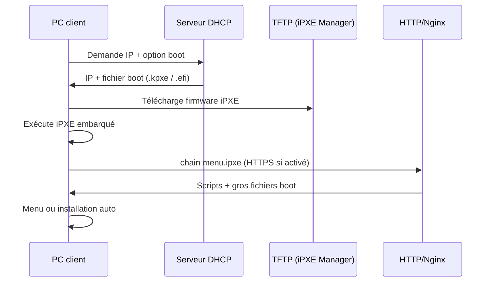

# Parcours de boot PXE (vue utilisateur)

Ce chapitre décrit **ce qui se passe sur le client** quand tout est correctement configuré dans iPXE Manager et sur le **DHCP** de votre réseau. Aucune installation logicielle côté PC : uniquement le boot réseau (F12, F11, etc.).

---

## Vue d’ensemble

> ### 📷 Emplacement capture
> **Fichier suggéré :** `Documentation/images/15-pxe-sequence-diagram.png`
>
> **Description de la photo :** Export du schéma ci-dessus (Mermaid rendu ou dessin manuel) pour impression / wiki.
>
> **Éléments à cadrer :** Les 4 acteurs et les flèches TFTP puis HTTP.

---

## Étape 1 — BIOS ou UEFI choisit le réseau

Sur le PC :

1. Entrer dans le menu boot (souvent F12, F11, Esc).
2. Choisir **LAN / PXE / IPv4 Network**.

> ### 📷 Emplacement capture
> **Fichier suggéré :** `Documentation/images/15-client-bios-pxe-menu.png`
>
> **Description de la photo :** Photo ou capture du menu boot **firmware du PC** (pas l’UI web) avec l’entrée « Network boot » sélectionnée.
>
> **Éléments à cadrer :** Ligne PXE/Network surlignée.

---

## Étape 2 — DHCP attribue IP et fichier de boot

Le serveur DHCP (pfSense, ISC, Windows Server, etc.) doit fournir :

- **Adresse IP** du client
- **Serveur TFTP** (souvent `next-server` = IP iPXE Manager)
- **Nom du fichier** selon le type de machine :

| Machine | Fichier TFTP typique |
|---------|---------------------|
| BIOS Legacy | `undionly.kpxe` |
| UEFI (VM Proxmox, etc.) | `snponly.efi` |
| UEFI bare-metal | `ipxe.efi` |

Ces fichiers sont produits par **Firmware** dans l’UI. Aide DHCP en bas de [09-firmware-ipxe.md](09-firmware-ipxe.md).

> ### 📷 Emplacement capture
> **Fichier suggéré :** `Documentation/images/15-dhcp-pfsense-options.png`
>
> **Description de la photo :** Capture de l’écran DHCP de votre routeur montrant next-server et filename (masquer IP publiques si besoin).
>
> **Éléments à cadrer :** Champs filename et TFTP server, pas l’UI iPXE Manager.

---

## Étape 3 — TFTP charge le petit firmware

Écran client typique : messages **iPXE** courts, chargement du `.kpxe` ou `.efi` (quelques secondes).

Si échec ici :

- Fichier absent → page **Firmware** : cartes « Absent »
- Mauvais fichier UEFI → essayer `snponly.efi` vs `ipxe.efi`

> ### 📷 Emplacement capture
> **Fichier suggéré :** `Documentation/images/15-client-ipxe-initial-tftp.png`
>
> **Description de la photo :** Écran noir/console du PC au tout début du chain iPXE (lignes « iPXE initializing… » ou équivalent).
>
> **Éléments à cadrer :** Mention iPXE et éventuellement le nom du fichier chargé.

---

## Étape 4 — Chain HTTP vers le menu

Le firmware compilé contient un **embed** qui fait :

- `dhcp` (ou config réseau)
- `chain` vers l’URL du menu, ex. `http://192.168.x.x/menus/menu.ipxe`

L’URL vient de **Paramètres → URL du serveur** et de la compilation **Firmware**.

> ### 📷 Emplacement capture
> **Fichier suggéré :** `Documentation/images/15-firmware-embed-url-match.png`
>
> **Description de la photo :** Côte à côte : champ URL dans Paramètres + section embed Firmware montrant la **même** URL de menu.
>
> **Éléments à cadrer :** Les deux URL identiques (schéma composite accepté).

---

## Étape 5 — Menu iPXE à l’écran

Le client affiche le **menu graphique** iPXE (fond bleu, entrées par OS, logo en bas à droite si personnalisé).

Contenu généré par iPXE Manager : onglet **Menus générés** → `menu.ipxe`.

> ### 📷 Emplacement capture
> **Fichier suggéré :** `Documentation/images/15-client-ipxe-menu-on-screen.png`
>
> **Description de la photo :** Photo de l’écran du PC client montrant le menu iPXE (plusieurs entrées Debian/Ubuntu/Windows…).
>
> **Éléments à cadrer :** Titre du menu, au moins 2 entrées, logo personnalisé si configuré.

> ### 📷 Emplacement capture
> **Fichier suggéré :** `Documentation/images/15-menus-generated-matches-client.png`
>
> **Description de la photo :** Composite : capture navigateur du script `menu.ipxe` (UI) + même entrées visibles sur le client PXE.
>
> **Éléments à cadrer :** Correspondance des libellés d’entrées entre UI et client.

---

## Étape 6 — Choix d’une entrée → boot d’une version

Selon l’entrée :

- **Linux** : téléchargement `vmlinuz` / `initrd` en HTTP, parfois NFS ou repo
- **Windows** : `boot.wim`, scripts WinPE générés
- **Installation auto** : preseed / cloud-init / kickstart injecté si config active sur la version

Configuration côté UI :

- Version prête : [05-isos-fiche-version.md](05-isos-fiche-version.md)
- Config active : [07-configurations-automatiques.md](07-configurations-automatiques.md)

> ### 📷 Emplacement capture
> **Fichier suggéré :** `Documentation/images/15-client-linux-boot-http.png`
>
> **Description de la photo :** Console client pendant téléchargement du noyau (lignes « Loading vmlinuz… » ou barre de progression iPXE).
>
> **Éléments à cadrer :** URL HTTP du serveur visible dans les messages.

---

## Cas HTTPS

Si le site est en **HTTPS** :

1. Certificat valide (ou auto-signé) sur Nginx
2. Firmware **recompilé** avec CA embarquée (`TRUST`)
3. URL du menu en `https://…`

Sinon : erreurs TLS sur le client iPXE. Workflow : [10-parametres.md](10-parametres.md) + [09-firmware-ipxe.md](09-firmware-ipxe.md).

> ### 📷 Emplacement capture
> **Fichier suggéré :** `Documentation/images/15-client-https-chain-error.png`
>
> **Description de la photo :** (Optionnel, pour doc dépannage) Écran client avec erreur certificat / impossible de charger menu.
>
> **Éléments à cadrer :** Message d’erreur TLS lisible.

---

## User-class iPXE (DHCP avancé)

Quand le client **est déjà** iPXE (après le premier TFTP), le DHCP peut renvoyer directement l’**URL HTTP** du menu au lieu du fichier TFTP — évite un second TFTP inutile.

La carte d’aide **DHCP** sur la page Firmware résume cette option.

> ### 📷 Emplacement capture
> **Fichier suggéré :** `Documentation/images/15-dhcp-user-class-ipxe.png`
>
> **Description de la photo :** Extrait de config DHCP montrant la section user-class `iPXE` avec option filename = URL HTTP du menu.
>
> **Éléments à cadrer :** Bloc user-class et URL `http(s)://…/menus/menu.ipxe`.

---

## Checklist avant premier test PXE

| # | Vérification dans l’UI |
|---|------------------------|
| 1 | **Paramètres** : URL HTTP correcte |
| 2 | **Firmware** : les 3 binaires « Présent » |
| 3 | Au moins une **version ISO** « Prête » |
| 4 | **Menus** régénérés récemment |
| 5 | **DHCP** configuré (hors UI) |
| 6 | Client sur le **même VLAN** que le serveur |

> ### 📷 Emplacement capture
> **Fichier suggéré :** `Documentation/images/15-checklist-dashboard-all-green.png`
>
> **Description de la photo :** Tableau de bord avec cartes OS montrant versions prêtes + pas d’alerte TLS rouge + aucun job bloqué.
>
> **Éléments à cadrer :** Compteurs « prêtes », disque pas plein à 100 %.

---

## Voir aussi

- [00-introduction-et-concepts.md](00-introduction-et-concepts.md)
- [09-firmware-ipxe.md](09-firmware-ipxe.md)
- [08-menus-ipxe.md](08-menus-ipxe.md)
- [16-depannage-interface.md](16-depannage-interface.md)
